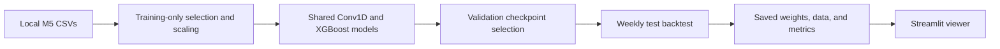

# Retail Demand Forecasting Demo

Predict the next **7 days** of sales from **56 days** of history. A small shared
PyTorch Conv1D model learns from 100 Walmart product–store series; Streamlit lets
you inspect forecasts alongside actual sales, a shared XGBoost model, and the
previous-week baseline. All three methods report MAE on the same test targets.
The overall comparison includes mean RMSSE and a WRMSSE adapted to the demo subset.

| Component | Purpose |
| --- | --- |
| PyTorch Conv1D | Sales patterns, series identity, and calendar features |
| XGBoost | Tree-based forecast with sales lags, series identity, and calendar features |
| Seasonal baseline | Repeat the previous seven days |
| Chronological backtest | Compare MAE over several unseen forecast weeks |
| Streamlit | Plot history, actual sales, and all three forecasts |
| uv / MkDocs | Dependency management and documentation |

Start with [installation](getting-started/installation.md), then read the
[pipeline](architecture/index.md) and [evaluation guide](operations/evaluation.md).
See [Improving the models](operations/improvements.md) for experiments inspired
by the competition winner.
Use the [notebook walkthrough](operations/notebook.md) to reproduce both runs and
try new settings one stage at a time.
The [Code Reference](reference/index.md) is generated from Python docstrings.
See [Publish the documentation](operations/deployment.md) to deploy this site to GitHub Pages.

!!! note "Build these docs"
    Run `make docs` to serve the site at <http://127.0.0.1:8000>.
    Use `make docs-build` for a strict static build.
